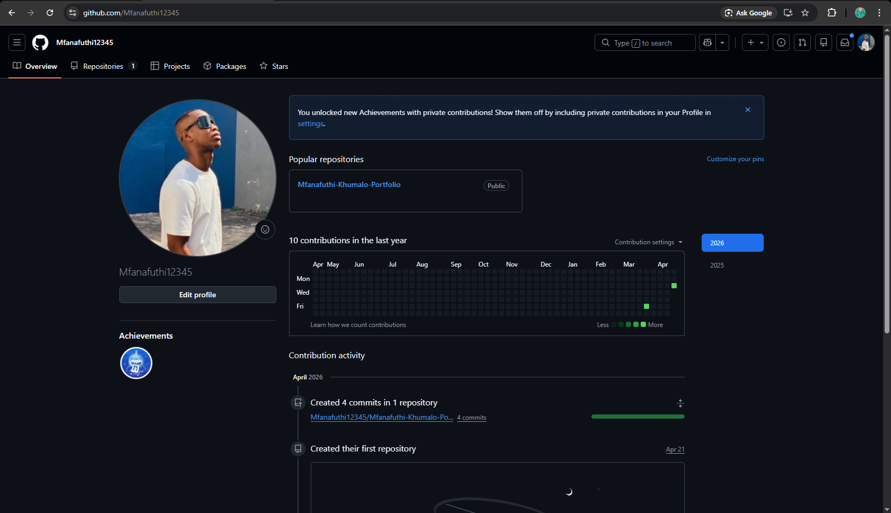

## 📄 About Me
As a 23 year old aspiring IT candidate specializing in Applications Development undergoing my final year. I a strong interest in being flexible and a willingness to learn and grow in other fields  . I have  knowledge in Java, Python as well as HTML. My dedication to continuous learning and adaptability makes me a  promising candidate ready to contribute and grow within any field more especially in a Technological environment. And most importantly I work best with teams.

---

## 📑 CV

### 🎓 Education
- **Cape Peninsula University of Technology**  
  Diploma in ICT (Application Development) – *In Progress*

- **Domino Servite School (2018–2022)**  
  Senior Certificate  

---

### 🛠️ Technical Skills

**Programming Languages**
- Java, SQL, JavaScript, HTML, CSS  

**Software Development**
- MySQL  
- Database Design & Normalization  
- Complex Queries (JOIN, GROUP BY, Subqueries)  

**Tools & Technologies**
- NetBeans  
- IntelliJ IDEA  
- Figma  

**Additional Skills**
- Object-Oriented Programming (OOP)  
- GUI Development (Java Swing / JavaFX)  
- Debugging  
- Basic System Analysis  

---

### 💼 Work Experience 
EPWP Supervisor
WasteWant | Nov.2024- July.2025
Signing of Timesheets 
Ordering Stock
Supervising workers

aQuelle | Nov.2020-Jan.2023
MTC operator 
Pallet stacking
Cleaning

---

### 📂 Projects
- Built a website  
- Created wireframes for Improved Bash Clothing App (Figma)  
- Developed an application for students to purchase books and devices  
- Built a Java-based enrollment system for students and administrators  
- Developed a simple calculator  
- Worked with arrays and lists  
- Built menu-driven console programs  

---

## 🎥 Mock Interview Video
[Watch my mock interview](interview.mp4)
<video width="600" controls>
  <source src="interview.mp4" type="video/mp4">
</video>
---

## 🧠 Reflection – Coding in Markdown 

**Situation:**  
As part of this assessment, I was required to create a digital portfolio using GitHub and Markdown. Before this task, I had little to no experience working with Markdown or structuring professional content for the web.

**Task:**  
My responsibility was to learn how Markdown works and use it to convert my CV and portfolio content into a well-structured, readable, and professional format that could be viewed online.

**Action:**  
I researched Markdown syntax, including headings, lists, links, and formatting techniques. I practiced by experimenting with different layouts and structures before finalizing my portfolio. I also ensured that my content was logically organized into sections such as education, skills, work experience, and projects. Additionally, I focused on keeping the layout clean and easy to read for anyone viewing it.

**Result:**  
I successfully created a professional digital portfolio using Markdown. Through this process, I improved my technical documentation skills and gained confidence in using GitHub as a development tool. I now understand how developers present and share their work online in a structured way.

---

## 🧠 Reflection – Mock Interview

**Situation:**  
I participated in a mock interview as part of my work readiness training. This was an opportunity to simulate a real job interview environment.

**Task:**  
My task was to present myself professionally, answer questions clearly, and demonstrate confidence while communicating my skills and experiences.

**Action:**  
I prepared by reviewing common interview questions and thinking about how to answer them effectively. I practiced my responses to improve clarity and confidence. During the recording, I focused on maintaining good posture, speaking clearly, and staying calm under pressure. I also made sure to present my strengths and experiences in a structured way.

**Result:**  
The mock interview helped me identify areas where I can improve, such as reducing nervousness and improving fluency when speaking. It also boosted my confidence and prepared me for real-world interviews. I now have a better understanding of how to present myself professionally.

---

## 🌐 Reflection – GitHub Pages 

**Situation:**  
As part of the portfolio requirements, I needed to publish my work online using GitHub Pages so it could be accessed publicly.

**Task:**  
My task was to deploy my GitHub repository and ensure that my portfolio was correctly displayed as a live website.

**Action:**  
I learned how GitHub Pages works and followed the steps to enable it through the repository settings. I ensured that my README file was properly formatted so that it would display correctly on the website. I tested the link multiple times to confirm that everything was working as expected.

**Result:**  
I successfully published my portfolio online, making it accessible through a public link. This improved my understanding of web deployment and version control. It also gave me a professional online presence where I can showcase my work to lecturers and potential employers.

## 📞 References

Mr Frank- +27 65 133 0592( WasteWant)
aQuelle-+27 (0)32 492 0500
